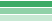
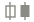
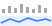

# TQQQ Support Level Report

A daily-updated web dashboard that finds and visualises **support levels** in TQQQ — the price areas where the fund has repeatedly stopped falling and turned back up. It runs on GitHub Pages, refreshes itself every weekday evening after the US market close, and needs no server, database or paid data feed.

**Live site:** https://mpromisel002.github.io/TQQQ-Technical-Analysis-Report/

The look-back window is configurable from **1 month up to 12 months** (or any custom number of trading sessions between 21 and 252), and the whole report recalculates instantly in the browser when you change it.

> **Educational use only — not investment advice.** See [Disclaimer](#disclaimer).

---

## Contents

- [Start here: what the page tells you](#start-here-what-the-page-tells-you)
- [Plain-English glossary](#plain-english-glossary)
- [What's on the page, section by section](#whats-on-the-page-section-by-section)
- [What the key findings cover](#what-the-key-findings-cover)
- [How to read the main chart](#how-to-read-the-main-chart)
- [Settings you can change](#settings-you-can-change)
- [How support levels are calculated](#how-support-levels-are-calculated)
- [Methodology, provenance & comparable reports](#methodology-provenance--comparable-reports)
- [How the daily refresh works](#how-the-daily-refresh-works)
- [Repository layout](#repository-layout)
- [Setup](#setup)
- [Run it locally](#run-it-locally)
- [Limitations you should know about](#limitations-you-should-know-about)
- [Disclaimer](#disclaimer)

---

## Start here: what the page tells you

TQQQ is an exchange-traded fund that aims to deliver **three times the daily move** of the Nasdaq-100. It moves fast — roughly 3–4% on an average day — so the question "where has buying reliably shown up before?" is a useful one.

This report answers that question in four steps:

1. It finds every **swing low** in the chosen period — days where the price dipped and then turned back up.
2. It **groups** nearby swing lows into price *zones*, because real support is an area, not an exact number.
3. It **scores** each zone from 0 to 100 on how dependable it has been.
4. It draws the strongest five zones on the chart, labels them **S1** (closest to today's price) through **S5**, and writes out what it found in plain sentences.

Everything else on the page — the trend call, RSI, MACD, the TQQQ-vs-QQQ comparison — is context to help you judge whether those levels are likely to matter right now.

---

## Plain-English glossary

No prior charting knowledge needed. These are the only terms the report uses.

| Term | What it means |
|---|---|
| **TQQQ** | ProShares UltraPro QQQ, a fund that targets 3× the *daily* return of the Nasdaq-100 index. It resets that 3× target every day, which is why its return over a month is rarely exactly 3× the index's monthly return. |
| **QQQ** | The plain, unleveraged Nasdaq-100 fund. Used here as the benchmark to compare against. |
| **Support** | A price area where buyers have repeatedly stepped in and stopped a fall. It describes what has happened before — it is not a promise about the future. |
| **Swing low** | A single day that is lower than the 3 days before it *and* the 3 days after it. A local bottom. The "3" is the **swing period**, and it is adjustable. |
| **Pending swing low** | A recent dip that looks like a swing low but can't be confirmed yet, because the 3 days that have to follow it haven't happened. Drawn as a hollow marker. |
| **Zone** | Several swing lows at nearly the same price, merged into one band. Shown as a shaded green stripe on the chart. |
| **Touch** | One swing low inside a zone. A zone touched 5 times has been defended by buyers 5 separate times. |
| **Window** | How far back the method looks. A 12-month window surfaces long-standing levels; a 1-month window surfaces only what is relevant right now. |
| **Broken level** | Price closed clearly below a zone. That zone stops counting as support and drops off the list; the break is reported under "What changed". |
| **Strength** | A 0–100 score combining how often, how recently, on what volume and with what follow-through a zone has held. Labelled **Strong** (70+), **Moderate** (40–69) or **Weak** (under 40). |
| **Moving average (MA)** | The average closing price over the last 20, 50 or 200 days. A smoothed line that shows the direction of the trend without the daily noise. |
| **Golden cross / death cross** | The 50-day average crossing above (golden) or below (death) the 200-day average. A widely watched, slow-moving trend signal. |
| **ATR** (Average True Range) | The size of a typical day's move, in dollars. TQQQ's ATR is used here to decide how wide a support zone should be, and how far below a level a protective stop would sit. |
| **RSI** (Relative Strength Index) | A 0–100 momentum gauge. Above 70 the recent rise looks stretched; below 30 the recent fall looks stretched. Neither is a buy or sell signal on its own. |
| **MACD** | Compares a fast and a slow moving average to show whether momentum is building (bullish) or fading (bearish). |
| **Bollinger Bands** | A band drawn two standard deviations above and below the 20-day average — a sense of what "normal range" currently means. |
| **Drawdown** | How far below its 12-month high the price currently sits, as a percentage. |
| **Beta** | How much TQQQ moves for each 1% move in QQQ. It should sit near 3.0; a reading far from 3 is worth a second look at the data. |
| **Trading session** | One day the US market is open. There are about 21 in a month and 252 in a year — which is why the window presets are 21, 63, 126, 189 and 252 sessions. |

---

## What's on the page, section by section

| Section | What it shows | Why it's there |
|---|---|---|
| **Bottom line** | A one-sentence headline, then five labelled lines: nearest floor, what happens if it breaks, trend, momentum, risk | The answer before the evidence. A reader who stops here still leaves with the number that matters |
| **All findings** (collapsed) | 10+ plain-language findings in four groups — support levels, trend, momentum & volatility, risk & leverage | The full picture for anyone who wants it, one click away; see [What the key findings cover](#what-the-key-findings-cover) |
| **KPI strip** | Last close, trend, nearest support, strongest support, RSI, distance below the 12-month high | The six numbers most decisions start from |
| **Price & support zones** | Candlestick chart with shaded green support bands, swing-low markers, moving averages, and optional volume / RSI / MACD / drawdown panels | The main visualisation — see [How to read the main chart](#how-to-read-the-main-chart) |
| **Support levels in detail** | A table of S1–S5: zone price, zone range, distance below price, times held, last tested, strength and status | The numbers behind the chart, with a definition list underneath every column |
| **Does the level hold up at other window lengths?** | The same method run over 1, 3, 6 and 12 months, one column each | Guards against cherry-picking. A level that appears in only one window may be an artefact of that window; a level that appears in three or more is far more dependable |
| **TQQQ vs QQQ** | Growth of $100 over the window, plus return, beta and volatility | Shows the cost of daily 3× resetting — TQQQ's return over a period is usually *not* 3× QQQ's return over that period |
| **Technical indicators** | Moving averages, RSI, MACD, Bollinger Bands, ATR and volume, each with a reading and a plain-language explanation | Context: is the broader trend helping or fighting these levels? |
| **What changed since the previous session** | New, broken, reclaimed and dropped levels, plus trend and momentum changes | A daily diff, so returning readers only have to read what moved |
| **Method, definitions & data** | Glossary, the full method, and the data provenance | Everything needed to audit or reproduce the numbers |

Two download buttons sit in the toolbar: **Download CSV** (the levels table plus every daily row in the window, with indicators) and **Download PNG** (the chart as an image, captioned with the window and data date).

---

## What the key findings cover

The card leads with a **bottom line** — one headline sentence and five labelled lines (nearest floor, if that breaks, trend, momentum, risk) — and keeps the full findings list collapsed behind a toggle, so the summary is never buried under the evidence. The toggle state is remembered per browser.

The findings are generated from the data on every load — nothing is written by hand — and they re-run whenever you change the window or the method settings. A normal window produces **14 findings** in four groups; a window too short to contain much structure still produces at least ten, with the support findings saying so plainly rather than going quiet.

| Group | Findings |
|---|---|
| **Support levels** | 1. `S1`, the first floor under price: its band, distance, number of touches, date last tested and strength score.<br>2. The next level down and the gap to it, expressed both in percent and in *typical days of movement*, so the drop has a time dimension.<br>3. The most dependable level in the window, with its touch count, volume versus the window average and score.<br>4. Cross-window confirmation — which levels survive at least three of the 1, 3, 6 and 12-month look-backs.<br>5. The rolling low as the immediate floor, plus a count of any zones that have broken. |
| **Trend** | 6. The trend call and which of the three checks agree or conflict.<br>7. Price versus the 50- and 200-day averages, the 50-day slope over 20 sessions, and the date of the last golden or death cross.<br>8. Distance below the 12-month high, position within the 12-month range, the number of confirmed swing lows, and whether the last two are rising. |
| **Momentum & volatility** | 9. RSI, read as *confirmation* for the levels rather than a signal of its own.<br>10. MACD direction and the width of the gap to its signal line.<br>11. Bollinger position, today's ATR against the window's median ATR (a calm-or-choppy read), and volume against its 20-day average. |
| **Risk & leverage** | 12. Typical daily move, and where a stop one full day's range below `S1` would sit.<br>13. TQQQ against QQQ over the window: actual return, the naive 3× return, **the compounding lost to daily resetting**, beta and annualised volatility.<br>14. What the levels are not — plus how many recent dips are still unconfirmed, and therefore able to change the picture. |

Two design choices worth naming. Findings are **grouped rather than ranked**, because a reader looking for risk should not have to scan momentum to find it. And the wording follows the numbers: the same finding says "calmer than usual", "about normal" or "choppier than usual" depending on where the current reading sits against its own window, instead of asserting a fixed threshold.

---

## How to read the main chart

| | What you see | What it means |
|:--:|---|---|
|  | **Shaded green band** | A support zone. It spans the whole chart because a support level is a price, not a moment in time. |
|  | **Darker green = stronger** | Opacity is stepped by the strength tier, so Strong zones are visibly darker than Weak ones. |
|  | **Green tag, right edge** | The zone's ID and its centre price. **S1** is nearest today's price, **S5** is furthest below. |
|  | **Dark tag, right edge** | The last closing price. |
|  | **Solid green triangle** | A swing low that helped build one of the five levels shown. |
|  | **Faded green triangle** | A swing low that did not make the top five. |
|  | **Hollow green triangle** | A pending swing low — too recent to confirm, because the three sessions that have to follow it haven't happened. |
|  | **Hollow / filled candle** | An up day / a down day. Shape as well as colour, so direction still reads for colour-blind viewers. |
|  | **Pink staircase** | The rolling 3-day low — the lowest low of the last three sessions, and the nearest very-short-term floor. |
|  | **Blue / orange / purple lines** | The 20-, 50- and 200-day moving averages. |
|  | **Greyed-out area on the left** | History *outside* the window you chose. Shown for context; not used to find levels. |
|  | **Panels below the price** | Volume, RSI, MACD and drawdown, all sharing the same date axis. |

**Interaction:** hover or tap for the numbers behind any day, drag sideways to pan, Ctrl/⌘ + scroll or pinch to zoom, double-click to reset. The **Show:** chips under the legend turn the optional panels and overlays on and off; your choices are remembered in your browser.

Only Volume and RSI are on by default — the chart is deliberately quiet until you ask for more.

---

## Settings you can change

### The window (the headline setting)

Buttons for **1M, 3M, 6M, 9M, 12M**, plus a free-text box for any value from **21 to 252 trading sessions**. A shorter window reacts faster and finds fewer, more recent levels; a longer window finds levels that have survived more market conditions.

### Method settings (under the "Method settings" dropdown)

| Setting | Range | Default | What it does |
|---|---|---|---|
| **Swing period** | 2–10 sessions | 3 | How many days either side of a dip must be higher for it to count as a swing low. Higher = fewer, more significant lows. |
| **Cluster distance** | 0.25–1.5 × ATR | 0.5 | How close two swing lows must be to be merged into one zone. Higher = fewer, wider zones. |
| **Minimum touches** | 1–5 | 1 | Drop zones that have been tested fewer than this many times. Set to 2 to see only levels that have held more than once. |

### Shareable links

Every setting is written into the page address, so any view can be bookmarked or sent to someone else:

```
?window=6m                 six-month window
?window=100                custom 100-session window
?window=6m&period=5        six months, 5-day swings
?window=12m&cluster=0.75&touches=2   wider zones, only levels held twice or more
```

---

## How support levels are calculated

The whole method lives in one file, [`docs/js/support.js`](docs/js/support.js). The same file runs in the browser, in Node for the nightly snapshot job, and in the unit tests — so there is exactly one implementation to audit.

**1. Find the swing lows.**
A day is a swing low when its low is the lowest from *N* sessions before it to *N* sessions after it (*N* = the swing period, 3 by default). The most recent *N* sessions can't be confirmed yet — a lower low could still arrive — so they are marked *pending* and drawn hollow.

**2. Compute the rolling low.**
Separately, the lowest low of the last *N* sessions is tracked at every bar and drawn as a step line. This is the literal "3-day rolling period" floor, and it doubles as a fallback level when a window is too short to contain any confirmed swing low.

**3. Cluster nearby lows into zones.**
Swing lows within `clusterDistance × ATR(14)` of each other are merged. At the default 0.5 × ATR that is roughly 2–3% of TQQQ's price. Each zone gets:
- a **zone price** — the volume-weighted average of its lows, so the days with the heaviest trading pull the number towards them;
- a **zone range** — from the lowest to the highest low in the group.

**4. Score each zone from 0 to 100.**

| Component | Weight | How it's measured |
|---|---|---|
| Touches | 40% | Number of swing lows in the zone, relative to the busiest zone in the window |
| Recency | 30% | How recently the zone was last tested, as a fraction of the window |
| Volume | 20% | Average volume on the touch days, versus the window's average volume |
| Bounce | 10% | How far price travelled away from the zone within the following 10 sessions |

Scores are normalised **within the selected window**, so they rank levels against each other — a score of 80 in a 1-month window is not directly comparable to an 80 in a 12-month window.

**5. Report the top five.**
The five highest-scoring live zones are kept, then re-ordered nearest-to-price first and labelled S1…S5.

**6. Drop broken zones.**
Once price closes more than half the cluster distance below a zone, that zone is no longer support. It leaves the table and the chart, and the break is reported in "What changed since the previous session". A zone that was broken earlier in the window but has since been reclaimed is flagged *broke once before* in the table — it has a track record of failing.

**7. When a window is too thin.**
If fewer than two confirmed zones are found (common with a 1-month window in a strong rally), the report falls back to the rolling low and the 50-day average, clearly labelled as fallbacks, and suggests a longer window.

### The trend call

Three independent checks, all of which must agree:

1. Is price above **both** the 50- and 200-day averages, or below both?
2. Is the 50-day average rising or falling over the last 20 sessions?
3. Are the last two swing lows rising or falling?

All three bullish → **Uptrend**. All three bearish → **Downtrend**. Anything else → **Mixed**, which is an honest answer rather than a forced call.

---

## Methodology, provenance & comparable reports

### Where each technique comes from

Nothing in this report is a private indicator. Every component is a documented, decades-old technique, which is deliberate: a level you cannot explain is a level you cannot defend to whoever asks about it.

| Component | Origin |
|---|---|
| **RSI** and **ATR** | J. Welles Wilder Jr., *New Concepts in Technical Trading Systems* (1978), which introduced both along with Wilder's smoothing method. ATR is used here for zone width and stop distance — closer to Wilder's original intent than the momentum reading RSI is usually reduced to. |
| **MACD** | Gerald Appel, developed in the late 1970s. Standard 12/26/9 parameters. |
| **Bollinger Bands** | John Bollinger, early 1980s. Used here only to say where price sits in its normal 20-day range, not as a signal. |
| **Swing highs and lows** | The generic pivot rule — a bar that is the extreme of the *k* bars either side. Bill Williams' "fractals" (*Trading Chaos*, 1995) are the best-known named version, using k = 2. This report defaults to k = 3, matching the brief, and exposes k as a setting. |
| **Higher lows as trend evidence** | Dow Theory's core observation that an advancing market makes successively higher lows. It is one of the three checks behind the trend call. |
| **Volume-weighted price levels** | The market-profile tradition associated with J. Peter Steidlmayer's work at the Chicago Board of Trade in the 1980s: price areas matter in proportion to the business transacted there. Zone prices here are volume-weighted for the same reason. |
| **Golden / death cross** | Long-standing 50/200-day moving-average convention with no single originator. Reported as a dated event, not a recommendation. |

### What this report decides for itself

Three things are **not** inherited from the literature, and should be treated as engineering judgment rather than established fact:

1. **The 0–100 strength score.** Weighting touches 40%, recency 30%, volume 20% and bounce 10% is a reasoned ranking heuristic, *not* a fitted or backtested model. It orders levels within one window; it is not a probability that a level will hold, and it should never be read as one.
2. **Clustering at 0.5 × ATR.** Merging swing lows within half an average day's range is a volatility-relative choice, so it adapts as TQQQ calms down or speeds up. The multiplier is adjustable precisely because it is a judgment call.
3. **The break rule.** A close more than half the cluster distance below a zone retires it. A tolerance is needed because a leveraged fund pierces levels intraday constantly; where exactly to set it is a choice.

### What the research actually supports

Worth stating plainly, because it affects how much weight the output deserves:

- Brock, Lakonishok and LeBaron, *Simple Technical Trading Rules and the Stochastic Properties of Stock Returns* (Journal of Finance, 1992), found statistically significant results for moving-average and trading-range-break rules on the Dow — while noting that transaction costs and data-snooping concerns temper the conclusion. Later work has argued much of the effect weakened after publication.
- Carol Osler's research at the Federal Reserve Bank of New York on published support and resistance levels in currency markets found that such levels did cluster with intraday reversals more often than chance — evidence that these levels function partly because enough participants watch them.

The honest summary: support levels are a defensible way to describe where transactions have clustered and where reversals have historically occurred. They are not a forecast, and this report is built to inform a decision rather than make one.

### Comparable reports

This dashboard sits in a well-populated genre. Useful reference points, if you want to compare format and rigour:

- **Broker technical-opinion pages** (Fidelity, Schwab and similar) — a single symbol, a trend verdict, a handful of indicator readings in plain language. Closest in audience to this report; generally shallower on method disclosure.
- **Charting-platform auto support/resistance indicators** (TradingView and StockCharts both host many) — the same pivot-detection-plus-clustering approach this report uses, usually drawn on the chart with no written explanation and no reproducibility.
- **Sell-side technical strategy notes** — a chart, marked levels, and a paragraph of narrative. Stronger on judgment, weaker on being re-runnable by the reader.
- **Quantitative factor tear sheets** (the style popularised by open-source portfolio-analytics libraries) — dense, reproducible, and aimed at practitioners. This report borrows their reproducibility while staying readable by a non-specialist.

Where this one differs: the method is a single auditable file, the window is a control rather than an assumption, every level carries its evidence (touches, dates, volume, score), and the whole report regenerates unattended each weekday.

---

## How the daily refresh works

```
GitHub Actions — every 30 min from 16:15 New York, first to find new data wins
  20:15 / 20:45 / 21:15 / 21:45 / 22:15 / 22:45 UTC  Mon-Fri
       = 16:15 - 18:45 New York in summer, 15:15 - 17:45 in winter
  11:30 UTC Tue-Sat  (7:30am New York, backstop before the next open)
  │
  ├─ pipeline/build.py     download TQQQ + QQQ daily prices
  │                        (yfinance → Yahoo chart API → Tiingo → Alpha Vantage)
  │                        validate, compute indicators, write docs/data/tqqq.json
  │
  ├─ pipeline/snapshot.js  save today's levels to docs/data/history/YYYY-MM-DD.json
  │                        and write docs/data/changes.json (the daily diff)
  │
  └─ commit to main  →  GitHub Pages serves /docs
```

- Prices are **adjusted for splits and dividends**. About two years of history are loaded so the 200-day average is available across the full 12-month view.
- **Nothing publishes unless the data passes validation:** no missing values, no zero-volume days, highs never below lows, no gaps in the trading calendar, and no single-day move above 40% (which usually means a bad split adjustment). If a check fails, the previous good file stays live.
- If a run fails, the workflow **opens a GitHub issue** (or comments on the existing one). The page also shows the data date in red and displays a banner if the data is more than two sessions old, so a silent failure can't go unnoticed.
- **Sources are raced on freshness, not just tried in order.** A source that validates is accepted immediately only if it reaches the most recent close; otherwise the remaining sources are tried and the freshest result wins. One provider lagging a session no longer decides what gets published.
- **The newest bar's close is recovered when the provider lags.** For a while after the bell Yahoo leaves `close` null in its daily array while already reporting that day's close in the quote summary. The pipeline fills it from there — but only once the session is genuinely over and the rest of the bar is complete, so an in-progress price is never written as a close.
- **The job tries every 30 minutes from 16:15 New York.** That start is not arbitrary: `fetch.py` treats a session as complete from 16:15, so a run a minute earlier cannot publish the day's bar at all. GitHub queues scheduled runs on shared infrastructure and starts them 1–4 hours late in practice, so no single slot is dependable — whichever one first finds a new session publishes it, and the others exit in about 30 seconds without committing. A `concurrency` group serialises them, so two runs can never race to push.
- Cron is UTC and does not follow daylight saving, so the slots are anchored to EDT. Through the winter they run 15:15–17:45 New York, where the first two land before the close, find nothing and cost about 30 seconds each; 16:15 EST is covered by the third slot.
- **A provisional close corrects itself.** Publishing minutes after the bell means the newest bar may still be settling, so a later run republishes it if the source has since moved it — a corrected close, or a volume restatement. The commit is labelled *Data revision* rather than *Data refresh* so the two are distinguishable in the history.
  - The thresholds are deliberately not zero: 2 basis points on prices and 2% on volume. Below those it is sources rounding differently or consolidated volume trickling in, not a correction, and republishing on that noise would commit on every slot.
  - Revision only applies while the bar is still the newest completed session, which bounds it to roughly one trading day. After that the values are fixed; use `python pipeline/build.py --force` to rewrite an older session.
- If every source is still behind when a run publishes, `build.py` records a note like *"data ends 2026-09-17, 1 trading day(s) before the expected last close 2026-09-18"* in the file's metadata, which the page shows under **Method & data**.
- **The page states its own freshness.** `SR.freshness()` compares the published date against the most recent weekday whose 4pm close has passed and resolves to one of three states:
  - **current** — nothing newer exists to publish, so no banner.
  - **pending** — a close has happened that the refresh has not published yet. The date chip reads *"update pending"* and a quiet banner explains that the report rebuilds after the close. This is the normal state between about 4pm and 8pm New York, and it used to look indistinguishable from a broken pipeline.
  - **stale** — more than two sessions behind, which a market holiday cannot explain. Red banner, and the date chip turns red.
- On weekends and market holidays the job finds no new session and exits cleanly without committing.
- **GitHub's cron is best-effort, not a guarantee.** Scheduled runs are queued on shared infrastructure and routinely start 1–2 hours late; under load they can be skipped entirely. That is the reason for the second daily run, and for the staleness banner on the page — neither the schedule nor any single run is treated as reliable on its own.
- **Scheduled workflows in a public repository are auto-disabled after 60 days of repository inactivity.** Do not assume the daily data commits reset that timer: pushes made by `github-actions[bot]` with the built-in `GITHUB_TOKEN` are widely reported not to count as the activity GitHub looks for. GitHub emails the repository admin before disabling, and re-enabling is one click in the Actions tab — treat that email as the real signal, and push a human commit occasionally if you want to be sure.
- The page is plain HTML, CSS and JavaScript with **no external dependencies** — the charts are drawn on a canvas by a small built-in library — so it loads fast and can't break because a CDN changed.

---

## Repository layout

| Path | Purpose |
|---|---|
| `docs/index.html` | The page structure and all explanatory copy |
| `docs/css/style.css` | Styling, including the light/dark colour tokens |
| `docs/js/support.js` | **The method.** Swing lows, clustering, scoring, trend call, snapshots and diffs |
| `docs/js/charts.js` | Dependency-free canvas charts: stacked panes with pan/zoom, and the window-comparison dot chart |
| `docs/js/app.js` | Page controller: loads data, runs the method, renders every section |
| `docs/data/tqqq.json` | Latest prices and indicators, rewritten by each run |
| `docs/data/history/` | One dated snapshot of the levels per session (about 18 months kept) |
| `docs/data/changes.json` | The diff between the last two snapshots |
| `pipeline/fetch.py` | Downloads and validates prices, with three backup sources |
| `pipeline/indicators.py` | Moving averages, RSI, MACD, Bollinger Bands, ATR, drawdown |
| `pipeline/build.py` | Builds `docs/data/tqqq.json` |
| `pipeline/snapshot.js` | Daily level snapshots and the "what changed" feed |
| `pipeline/tests/` | pytest checks on the saved price data |
| `tests/support.test.js` | Node unit tests for the support method |
| `.github/workflows/refresh.yml` | The daily schedule, manual trigger, tests, build, commit and failure issue |
| `.github/workflows/tests.yml` | Tests on every code push and pull request |

---

## Setup

Forking this into your own repository takes about two minutes:

1. **Enable GitHub Pages** — Settings → Pages → *Deploy from a branch* → `main` / `/docs`.
2. **Let the workflow push** — Settings → Actions → General → Workflow permissions → *Read and write permissions*.
3. *(Optional)* **Add backup data sources** — Settings → Secrets and variables → Actions → add `TIINGO_API_KEY` and/or `ALPHAVANTAGE_API_KEY`. Both providers offer free keys. Without them the pipeline still works; it just has fewer fallbacks if Yahoo is down.
4. **Do a first run** — Actions → *Refresh TQQQ data* → Run workflow.

GitHub Pages is free for public repositories; private repositories need a paid plan.

### Pointing it at a different ticker

The method makes no assumptions specific to leveraged funds, so it transfers to other symbols. Two places need editing: the symbol and benchmark strings in `pipeline/build.py` (the `fetch(...)` calls and the `meta` block), and the fund-specific wording in `docs/index.html` — the title, the subtitle and the leverage disclaimer.

---

## Run it locally

```bash
pip install -r pipeline/requirements.txt

python pipeline/build.py --force        # download prices and build the data file
node pipeline/snapshot.js               # levels snapshot + "what changed"

python -m pytest -q pipeline/tests      # Python tests (data validation)
node --test tests/*.test.js             # JavaScript tests (the method)

python -m http.server -d docs 8000      # then open http://localhost:8000
```

Useful variations:

```bash
# Build offline from CSV files (columns: date,open,high,low,close,adjclose,volume)
python pipeline/build.py --csv-dir path/to/folder --force

# Rebuild the level history for the last 30 sessions
node pipeline/snapshot.js --backfill 30
```

---

## Limitations you should know about

Worth reading before anyone acts on the output.

- **Support describes the past.** These levels are a summary of where buyers have shown up before. Markets are not obliged to repeat that, and in a leveraged fund a level can be cut through in a single session.
- **Levels depend on the settings.** Change the window or the swing period and the levels change. That is exactly why the window-comparison chart exists: a level that survives several window lengths is worth more attention than one that doesn't.
- **The last three sessions are provisional.** A swing low needs three sessions after it to be confirmed, so the most recent dips are shown as pending and can disappear.
- **Strength scores are relative, not absolute.** An 80 means "strong compared with the other zones in this window", not "80% likely to hold".
- **Leverage decay is real.** TQQQ's long-run path differs from 3× the Nasdaq-100's, especially through choppy markets. The TQQQ-vs-QQQ panel quantifies this for the window you selected.
- **Data can be wrong or delayed.** Prices come from free sources. The pipeline validates them and refuses to publish when a check fails, but no validation catches everything — the provenance line in the Method panel tells you which source produced the current file.
- **Nothing here is a trading system.** There is no entry rule, no position sizing and no backtest. It is a descriptive report.

---

## Disclaimer

For educational use only. **This is not investment advice.** TQQQ is a 3× leveraged ETF that resets daily; it can lose value quickly, and over periods longer than one day its return can differ greatly from 3× the Nasdaq-100's return. Support levels describe past trading and do not predict future prices. Data may be delayed or contain errors. Anyone acting on this information does so at their own risk.
